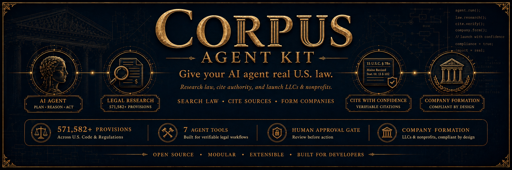
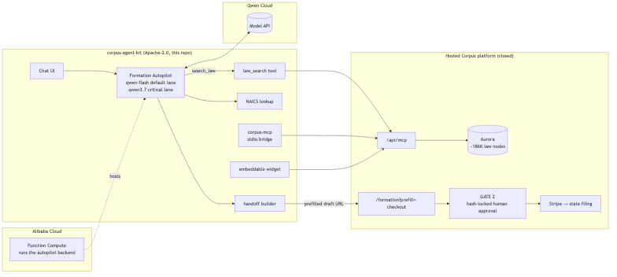

# corpus-agent-kit

**Give your AI agent real US law — and let it form a company.**

Open-source connectors for the [Corpus legal platform](https://corpuslaw.us):
search 571,582 provisions of federal, state, and municipal law with verbatim
citations, and run a complete LLC or nonprofit formation intake end to end.
Every filing still stops at a human approval gate.

[](https://qwencloud-hackathon.devpost.com/)
[](LICENSE)
[](https://smithery.ai/servers/renaissanceaisolutions/corpus-legal)

---

## Start here — pick your friction level

### 1. Zero install: point any MCP client at the hosted server

`https://corpuslaw.us/api/mcp` speaks streamable-HTTP MCP directly. No clone,
no build, no local process:

```json
{
  "mcpServers": {
    "corpus-law": {
      "type": "http",
      "url": "https://corpuslaw.us/api/mcp"
    }
  }
}
```

That is the whole setup. Ask your agent *"what does Mississippi require to form
an LLC?"* and it will answer from live statutes with citations you can check.

**Research is free to start:** 100 searches/month anonymously. A
[free API key](https://corpuslaw.us/settings) — instant, self-serve, no waiting
list — raises it to 1,000/month. Send it as `Authorization: Bearer <key>`.

### 2. Zero install: try the agent in a browser

**[corpuslaw.us/autopilot](https://corpuslaw.us/autopilot)** — the Formation
Autopilot from this repo (`autopilot/`), running on Alibaba Cloud Function
Compute. Describe a business in plain English; get a cited launch checklist and
a prefilled formation handoff.

### 3. Drop a skill folder — or install the Hermes plugin

Two portable [Agent Skills](https://agentskills.io/specification):

- [`skills/corpus-business-formation/`](skills/corpus-business-formation/) — LLC / nonprofit intake
- [`skills/corpus-legal-research/`](skills/corpus-legal-research/) — live statute search

Copy either folder into Claude Code, Codex, Cursor, VS Code, or Hermes and the
agent learns to reach for Corpus *before any MCP connection exists*
([install paths](skills/corpus-business-formation/README.md)).

Hermes can install **both skills plus the MCP URL** as one Agent Plugins v1
package (`plugins/corpus/`):

```bash
hermes plugins install teakesdev/corpus-agent-kit/plugins/corpus
hermes plugins enable corpus
hermes mcp test corpus
```

Portable packages install **disabled**; enable is a separate consent step.

### 4. Run it yourself

Clone and build — see [Quickstart](#quickstart) below.

---

## The seven tools

| Tool | What it does |
|---|---|
| `law.search` | Hybrid semantic + keyword search over 571,582 provisions |
| `law.get_node` | Full official text of one provision |
| `law.list_coverage` | Which jurisdictions are indexed, and how deeply |
| `formation.requirements` | A state's exact field checklist, quirks, live pricing |
| `formation.lookup_naics` | Find an industry code from a plain-English description |
| `formation.handoff` | Validate a draft → prefilled, human-approved handoff link |
| `account.status` | Quota, tier, and credit balance |

Formation tools are **never metered** — they stay free with or without a key.

## Coverage

18 jurisdictions, 16 fully searchable — federal (154,667 provisions),
California (181,312), Texas (119,923), Washington (51,487), Florida (24,848),
Mississippi (25,288), Wyoming, Delaware, Nevada, plus San Francisco, Seattle,
San Jose, Los Angeles, San Diego, Jackson and Philadelphia at the municipal
level (8 with published GIS zoning layers). Call `law.list_coverage` for the
live list — it reports honestly when a jurisdiction is not covered rather than
guessing.

## What's in this repo

- **`autopilot/`** — Formation Autopilot: a Qwen Cloud agent that turns an
  ambiguous founder description into a cited launch checklist and a prefilled,
  human-approved formation handoff. *(Qwen Cloud Hackathon Track 4 winner.)*
- **`mcp-server/`** — zero-dependency stdio MCP server, for clients that cannot
  speak HTTP MCP.
- **`widget/`** — embeddable law-search widget (Preact, ~12 kB gzipped).
- **`skills/corpus-business-formation/`** — portable Agent Skill (formation).
- **`skills/corpus-legal-research/`** — portable Agent Skill (live statute search).
- **`plugins/corpus/`** — Agent Plugins v1 package for Hermes (generated skill
  copies + headerless `mcp.json`).

All of these are thin clients of the hosted Corpus platform. The law corpus, hybrid
search engine, human approval gate, and filing execution live in the hosted
service — **this repo never touches money and never files anything.**

## Architecture

[](docs/architecture.md)

See [docs/architecture.md](docs/architecture.md) for the Mermaid source.

## What's open vs. what's hosted

| Layer | This repo (Apache-2.0) | Hosted Corpus platform (closed) |
|---|---|---|
| Formation Autopilot agent | ✅ `autopilot/` | — |
| Two-lane Qwen routing | ✅ `autopilot/src/` | — |
| MCP stdio bridge (`corpus-mcp`) | ✅ `mcp-server/` | — |
| Embeddable widget | ✅ `widget/` | — |
| Law database (571,582 provisions, Aurora) | — | ✅ |
| Hybrid search engine + `/api/mcp` | — | ✅ |
| `/formation` checkout + GATE 2 | — | ✅ |
| Stripe payment + state filing execution | — | ✅ |

## Two-lane model routing

The autopilot uses two Qwen models with different cost/quality profiles:

- **Fast lane** (`QWEN_MODEL_FAST`, default `qwen-flash`): all standard turns —
  intent parsing, law search, checklist generation. Low latency, low spend.
- **Critical lane** (`QWEN_MODEL_CRITICAL`, default `qwen3.7-max`): the final
  pre-handoff draft review only. Higher quality for the one turn that shapes the
  prefilled filing URL.

The lane switch is automatic. Routing logic lives in `autopilot/src/agent.ts`.
The hourly spend cap (`SPEND_CAP_TURNS_PER_HOUR`) applies across both lanes.

## Human in the loop (GATE 2)

The autopilot produces a **prefilled draft URL** — it never initiates a filing or
charges a card. On the Corpus platform side, every order passes GATE 2: a human
reviews and approves a snapshot of the exact filing payload, and that approval is
cryptographically bound to a hash of the payload. If the payload changes by a
single byte after approval, the gate rejects it. The agent is architecturally
incapable of bypassing this.

## Quickstart

### Prerequisites

```
node >=20
npm >=9
```

Clone and install all workspaces:

```bash
git clone https://github.com/teakesdev/corpus-agent-kit.git
cd corpus-agent-kit
npm install
```

### Environment variables

Copy and fill `.env.example` (required for autopilot; mcp-server and widget
read `CORPUS_BASE_URL` / `CORPUS_API_KEY` from env at runtime):

```bash
cp .env.example .env
# edit .env — at minimum set QWEN_API_KEY and CORPUS_API_KEY
```

| Variable | Default | Purpose |
|---|---|---|
| `QWEN_API_KEY` | _(required)_ | Qwen Cloud API key |
| `QWEN_BASE_URL` | _(required)_ | Qwen OpenAI-compatible base URL (e.g. `https://dashscope-intl.aliyuncs.com/compatible-mode/v1`) |
| `QWEN_MODEL_FAST` | `qwen-flash` | Fast-lane model — standard turns |
| `QWEN_MODEL_CRITICAL` | `qwen3.7-max` | Critical-lane model — pre-handoff review |
| `CORPUS_BASE_URL` | `https://corpuslaw.us` | Hosted Corpus platform base URL |
| `CORPUS_API_KEY` | _(optional)_ | Corpus platform API key (optional — anonymous is rate-limited) |
| `SPEND_CAP_TURNS_PER_HOUR` | `120` | Abuse guard: max agent turns per hour |
| `PORT` | `9000` | HTTP server port (autopilot backend) |

### autopilot — Formation Autopilot agent

```bash
cp .env.example .env        # fill QWEN_API_KEY + CORPUS_API_KEY
npm install
npm run build               # compiles all workspaces
cd autopilot && npm start   # starts the autopilot HTTP server
# open http://localhost:9000
```

The server exposes:

- `GET  /healthz` — liveness probe
- `POST /api/chat` — agent turn endpoint
- `GET  /` — chat UI

Deploy to Alibaba Cloud Function Compute: see
[autopilot/deploy/alibaba/README.md](autopilot/deploy/alibaba/README.md).

### mcp-server — stdio MCP bridge

**Most clients do not need this.** The hosted endpoint
`https://corpuslaw.us/api/mcp` speaks streamable-HTTP MCP directly — see
[Start here](#1-zero-install-point-any-mcp-client-at-the-hosted-server). Use
this bridge only for a client that can launch a stdio process but cannot speak
HTTP MCP.

```json
{
  "mcpServers": {
    "corpus-law": {
      "command": "npx",
      "args": ["-y", "@corpuslaw/mcp-server"],
      "env": { "CORPUS_API_KEY": "your-key-here" }
    }
  }
}
```

Nothing to clone or build. The bridge forwards every MCP request to the hosted
endpoint, adding your key — so formation handoffs it produces are attributed
to you. `CORPUS_API_KEY` is optional; without it the bridge runs on the
anonymous allotment.

> Use the full scoped name. `npx corpus-mcp` resolves to an unrelated package
> on npm — only `@corpuslaw/mcp-server` is ours.

<details>
<summary>Running from a clone instead</summary>

```bash
cd mcp-server && npm install && npm run build
```

```json
{
  "mcpServers": {
    "corpus-law": {
      "command": "node",
      "args": ["/absolute/path/to/corpus-agent-kit/mcp-server/dist/index.js"],
      "env": { "CORPUS_API_KEY": "your-key-here" }
    }
  }
}
```

Replace `/absolute/path/to/corpus-agent-kit` with the path to your clone.

</details>

### widget — embeddable law-search

```bash
cd widget
npm run build               # outputs dist/widget.js (loader) and dist/widget-app.js (app)
```

Embed in any page using the hosted loader. Point `src` at the Corpus host (a relative
path would 404 on the host page's own origin) and pass your widget key (`pk_…`):

```html
<script async src="https://corpuslaw.us/widget/widget.js"
        data-corpus-key="pk_live_…"
        data-corpus-origin="https://corpuslaw.us"></script>
```

## Deploy to Alibaba Cloud

See [autopilot/deploy/alibaba/README.md](autopilot/deploy/alibaba/README.md) for
Function Compute deploy instructions (Serverless Devs `s` CLI).

## License

Apache-2.0 — see [LICENSE](LICENSE).
