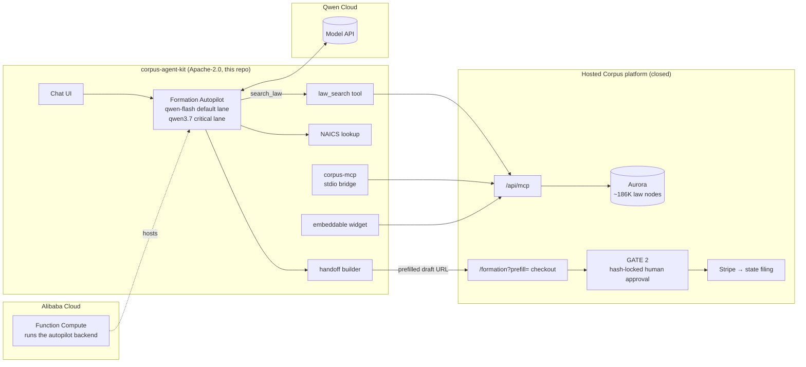

## Architecture

```mermaid
flowchart LR
  subgraph OPEN["corpus-agent-kit (Apache-2.0, this repo)"]
    UI[Chat UI] --> A[Formation Autopilot<br/>qwen-flash default lane<br/>qwen3.7 critical lane]
    A -->|search_law| MCPC[law_search tool]
    A --> N[NAICS lookup]
    A --> H[handoff builder]
    B[corpus-mcp<br/>stdio bridge]
    W[embeddable widget]
  end
  subgraph QC["Qwen Cloud"]
    Q[(Model API)]
  end
  subgraph ALI["Alibaba Cloud"]
    FC[Function Compute<br/>runs the autopilot backend]
  end
  subgraph CLOSED["Hosted Corpus platform (closed)"]
    MCP["/api/mcp"] --> DB[(Aurora<br/>~186K law nodes)]
    F["/formation?prefill= checkout"] --> G[GATE 2<br/>hash-locked human approval]
    G --> FILE[Stripe → state filing]
  end
  A <--> Q
  FC -.hosts.-> A
  MCPC --> MCP
  B --> MCP
  W --> MCP
  H -->|prefilled draft URL| F
```
